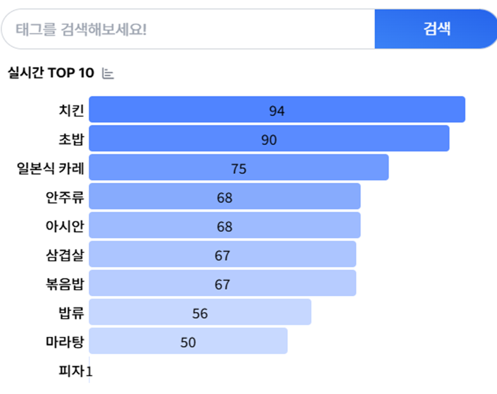
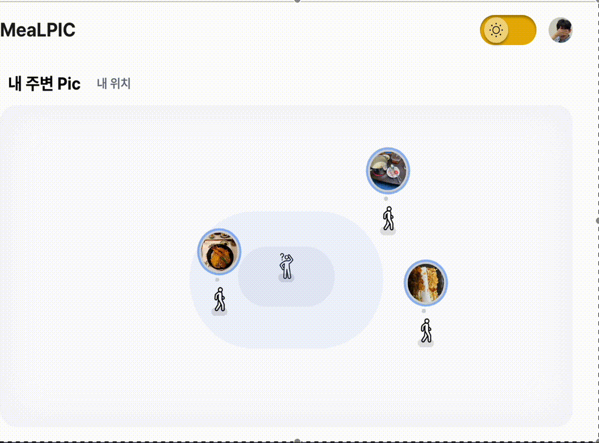
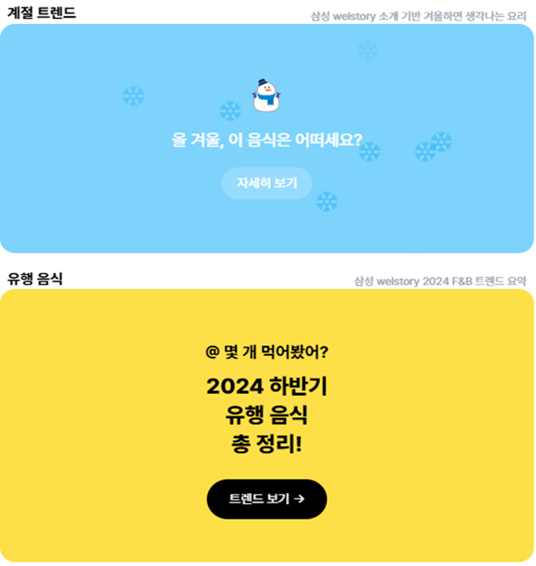

# MealPic, 실시간 음식 랭킹 & 저장 공유 서비스

**▷ 개발, 출시, 유지보수 기간 총 6주 (2025.01 ~ 2025.02)  **

## MealPic이 제공합니다

### 1. 음식 랭킹

### 2. 내 주변 Pick

### 3. 트렌드 파악

 
 

### 기술 스택

- DataBinding, MVVM
- Tailwind React Redux WebSocket PWA
- Firebase Analytics FCM, Kakao sdk

 
 

  <h3> 기술 스택 </h3>
  
  
  
  
  
   
  
  
  
   
  
  
  
  
   
  
  
  
  

 
 
